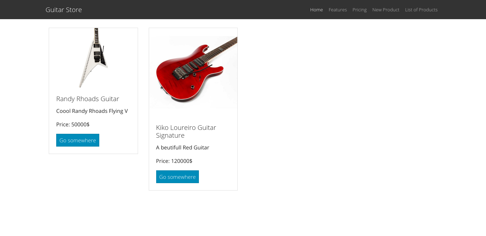

This project is under development right now. Probably this will be a tutorial for my Youtube Channel

# Guitar Store App
This is a webstore simple project using Node.js, Mongodb, Stripe, and other Javascript Technologies.
 

# Installation
```
cd nodejs-guitarstore
npm install
```

Then create the following environment variables

# Environment Variables
- MONGODB_URI, this is the MongoDB URL. By default is "localhost/guitarstore".
- PORT. The default port for your server. By Default is 4000
- CLOUDINARY_CLOUD_NAME
- CLOUDINARY_API_KEY
- CLOUDINARY_API_SECRET
- STRIPE_SECRET_KEY

# Start the project
This projects have two environments Development and production. To start in development mode run:
```
npm run dev
```
